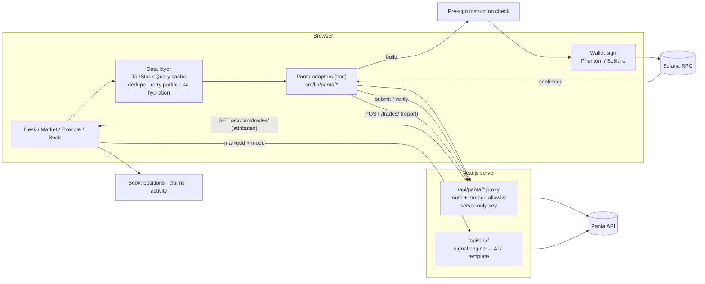

# Panta Brief Command

[](https://github.com/rishu4436/panta-brief-command/actions/workflows/ci.yml)

Dark-glass **prediction desk** on Solana powered by the [Panta API](https://docs.panta.market/). Intel → Execute → Book.

**Repo:** https://github.com/rishu4436/panta-brief-command  
**Powered by Panta:** https://panta.market

## What ships

| Slice | Status |
| --- | --- |
| **Intel** — market catalog, detail odds, trade tape, AI Market Brief (deterministic signals + interpretation) | Working |
| **Execute** — primary buy quote → build VT → pre-sign check → wallet sign → broadcast → on-chain confirm → submit → verify (polled ≤30s) → `POST /trades/` | Working |
| **Book** — positions list + win / creator-fee claim build → sign → broadcast; win claims reported → attributed, creator-fee claims labelled not attributed | Working |
| **UI** — modern dark glass trading terminal | Working |
| Server proxy `/api/panta/*` — explicit route + method allowlist, server key only | Working |

### Stubbed / deferred

- Secondary-market routing (desk is primary-buy focused)
- Attribution for creator-fee claims (Panta rejects them on `POST /trades/` with `TX_MISMATCH`, so the desk labels them as not attributed)
- Market creation flow (out of scope for this desk)

## Judge runbook

```bash
git clone https://github.com/rishu4436/panta-brief-command.git
cd panta-brief-command
cp .env.example .env.local
# paste PANTA_API_KEY from https://docs.panta.market/ (pk_test_… / pk_live_…)
npm install
npm run build
npm run dev
```

Open http://localhost:3000

### Demo path

1. **Intel** — catalog loads via `GET /markets/`. Open a market for detail odds (`GET /markets/{id}/`) + tape (`GET /markets/{id}/trades/`).
2. **AI Market Brief** (auto-runs on the market page) — pick **Desk read**, **Flow**, **Risk** or **Catalysts**. The card blocks (YES/NO, flow, signal, price vs flow, risk, execution, data quality) come from deterministic signals; the interpretation below them comes from OpenAI when `OPENAI_API_KEY` is set, otherwise from a template built on the same signals.
3. **Execute** — connect Phantom/Solflare → Quote → Build VT → pre-sign check → Sign & send → confirm → Submit → Verify → report (`POST /trades/`). "Attributed" only shows when Panta returns `processed` or the trade appears in `GET /account/trades/`.
4. **Book** — Refresh positions (`GET /positions/?wallet=`) → claim build for win or creator fees. Win claims are reported with `POST /trades/` ("reported for attribution"), then "attributed" once Panta returns `processed` or the claim appears in `GET /account/trades/?kind=claim`. Creator-fee claims are not reported and are labelled as not attributed.

## Env vars

| Var | Required | Notes |
| --- | --- | --- |
| `PANTA_API_KEY` | Yes | Server-only; never exposed to the browser |
| `PANTA_API_BASE_URL` | No | Default `https://live-api.panta.market/api/v1` |
| `NEXT_PUBLIC_DEFAULT_RPC` | Recommended | Solana mainnet RPC for the wallet connection (see RPC below) |
| `OPENAI_API_KEY` | No | Optional LLM interpretation of the signals (template fallback otherwise) |
| `OPENAI_MODEL` | No | Default `gpt-4o-mini` |

### RPC

Set `NEXT_PUBLIC_DEFAULT_RPC` to a **dedicated mainnet RPC** from a provider such as Helius, QuickNode, Triton or Alchemy. The public `https://api.mainnet-beta.solana.com` endpoint is only a fallback: it is heavily rate-limited, so balance reads, blockhash lookups and confirmation polling can fail or stall under load. When the fallback is in use, dev builds log a one-line note in the browser console. No provider is hardcoded.

## API surface used

Base `https://live-api.panta.market/api/v1` (trailing slashes required):

- `GET /markets/`, `GET /markets/{id}/`, `GET /categories/`, `GET /markets/{id}/trades/`
- `POST /primaryorderquote/`, `POST /primaryorderbuild/`, `POST /primaryordersubmit/`, `POST /primaryorderverify/`
- `GET /positions/?wallet=`
- `POST /claim/build/`, `POST /claim/creator-fees/build/`
- `POST /trades/`, `GET /account/trades/`

Browser calls `/api/panta/*`; the Next.js route forwards **only** the routes and methods listed in `src/lib/panta/routes.ts` (403 `ROUTE_NOT_ALLOWED` otherwise, 405 on a wrong method) and attaches the server's `X-Api-Key`. Client-supplied keys are ignored.

`POST /api/brief` accepts only `{ marketId, mode }` (`desk` | `flow` | `risk` | `catalysts`, default `desk`). The server fetches market detail + up to 50 tape rows from Panta, sanitizes them, rate-limits per IP (20/min, in-memory; a 429 shows a countdown in the card), and caches per market+mode for 60s. It returns `{ market, tape, signals, narrative, source, mode, generatedAt }`.

## AI Market Brief: signal engine

`src/lib/panta/signals.ts` is a pure function of (market detail, tape, now) that returns structured evidence. It makes no network calls and uses no randomness or model:

- YES/NO probability and its source (live spot, settled, or primary curve)
- tape count, YES/NO print counts and ratio, primary vs secondary prints, window, last-print age, top-wallet concentration
- flow imbalance, share-weighted from `shares`/`sharesBase` (print-weighted only if sizes are missing)
- recent volume in shares (USDC only when every print carries it), plus lifetime catalog volume
- minutes to resolution
- market price vs recent-flow divergence in points
- `dataQuality` (`high` / `medium` / `low`) with reasons
- `riskFlags`: thin tape, resolution < 24h, no price, primary quote vs spot, stale last print, one-sided or concentrated flow, divergence, and so on
- factual execution lines, e.g. "Primary YES and NO available · quote required before sizing"

Anything that can't be derived is `null` with a reason. For example, `probabilityChange` is always null because tape rows carry no per-trade price. The LLM receives this JSON and is told to interpret it, not recompute it, and never to give buy/sell or sizing advice. Every brief has four sections: **Observation / Evidence / Risk / Execution considerations**. If an LLM answer is missing a section or contains advice-like wording, the desk falls back to the template, which renders from the same signals, so the demo reads the same without an OpenAI key. **Catalysts** mode uses only the catalog description and resolution time, and says so when there is little to go on.

## Architecture



Plain-text version:

```
Browser ─▶ /api/panta/* (allowlist, server-only X-Api-Key) ─▶ Panta API
   │  catalog · detail · tape · positions · account trades (cached, zod-parsed)
   ├─▶ /api/brief { marketId, mode } ─▶ Panta detail + tape ─▶ signals.ts ─▶ AI or template
   └─▶ Execute: quote ▶ build ▶ pre-sign check ▶ wallet sign ▶ Solana confirm
                ▶ Panta submit / verify ▶ POST /trades/ ▶ attribution (processed / ledger) ▶ Book
```

- `src/lib/panta/`: the Panta adapter layer. `client.ts` (fetch + zod helpers), `markets.ts`, `orders.ts`, `positions.ts`, `claims.ts`, `attribution.ts`, `normalize.ts` (units), `routes.ts` (proxy allowlist), `signals.ts` (deterministic brief evidence), `instructions.ts` (pre-sign checks), `server.ts` (server-only upstream access). Components consume the domain types in `domain.ts` (`Market`, `Trade`, `Quote`, `Position`, `ClaimBuild`…), never raw Panta responses. Known values are typed unions with a string fallback (for example `MarketPhase = "primary" | "secondary" | "resolved" | "cancelled" | (string & {})`), so a new API value never breaks the page.
- Every response is parsed with zod at the adapter boundary. Schemas are loose (unknown fields pass), nullable fields are tolerated, and read paths degrade to empty/partial data with a dev-only console warning. Write paths (quote, build, claim build) throw on a malformed response, so nothing is ever signed from an unvalidated payload.
- `src/lib/data/`: one shared TanStack Query cache for the catalog, market details, tape, positions and the attribution ledger. Market list, market detail, the execute picker, AI brief, tape rail and Book all read from it, so no view reloads the catalog on its own. A partial market detail (no title and no prices) is retried twice with short backoff and never overwrites a fuller cached record. List rows hydrate details only when near the viewport (IntersectionObserver), at most 4 at a time. Panta has no batch detail endpoint, so Book fetches one detail per position market, capped and through the same cache.

## Security

- **Proxy allowlist.** `/api/panta/*` forwards only the routes, methods and query keys listed in `src/lib/panta/routes.ts`. Unknown routes get 403, wrong methods 405, encoded or traversal paths 400, bodies over 16 KB 413, non-JSON 415. Only the server's `PANTA_API_KEY` is sent upstream; client `X-Api-Key` / `Authorization` headers are dropped. Server modules import `server-only`, and the client bundle is checked for the key and upstream host.
- **Pre-sign instruction validation.** Before the wallet is asked to sign, the build is checked against the active quote (quote id, market, side, wallet) and every instruction must target an allowlisted program (Panta USDC program, Compute Budget, ATA, Token, System, Memo), include the Panta program, stay within 10 instructions, require no signer other than the wallet, and compile with the wallet as fee payer. Any mismatch blocks signing.
- **No custody.** The desk never holds keys or funds. Transactions are built by Panta, signed in the user's wallet and broadcast from the browser. The server only proxies read/build/report calls.
- **Brief limits.** `/api/brief` accepts only `{ marketId, mode }` (extra fields 400, bad mode 400, 2 KB body cap), rate-limits 20 requests per minute per IP, and caches each market+mode for 60 seconds, so repeat clicks don't re-bill the model. Evidence is fetched server-side, so clients can't inject data. The limiter and cache are in-memory per instance.

## Testing

```bash
npm test         # vitest run
```

Vitest covers units and formatting (1 USDC vs 1000000 base, `sharesBase`, 0.63 shown as 63%), the signal engine (YES lean, empty tape, resolved market), the proxy route (allowlisted 200 with fetch mocked, 403, 405, client key ignored, encoded path 400, oversized body 413), `/api/brief` validation and rate limiting (400s, 429), pre-sign instruction checks (fee payer, unknown program, allowed programs, instruction cap, quote/build mismatch), attribution status mapping, and the zod market adapter (passthrough, nullable fields, partial-record retry and merge). CI runs lint, test and build on every push and PR (`.github/workflows/ci.yml`, Node 22).

## Stack

Next.js App Router · TypeScript · Tailwind · TanStack Query · zod · `@solana/web3.js` · wallet-adapter (Phantom + Solflare) · Vitest

## Scripts

```bash
npm run dev      # local desk (webpack)
npm run build    # production build (webpack)
npm start        # serve build
npm run lint     # eslint, zero warnings expected
npm test         # vitest
```
