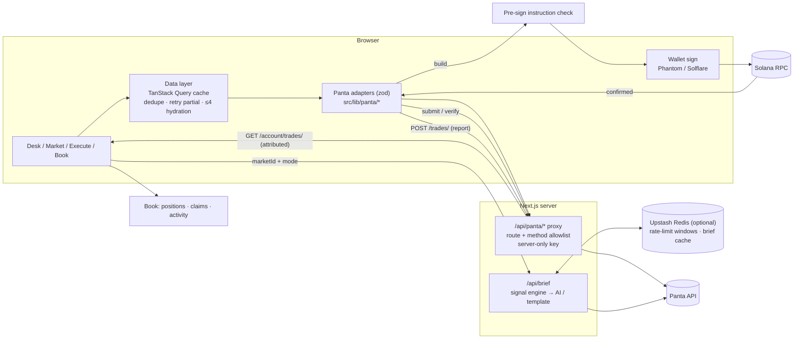

# Panta Brief Command

[](https://github.com/rishu4436/panta-brief-command/actions/workflows/ci.yml)

Dark-glass **prediction desk** on Solana powered by the [Panta API](https://docs.panta.market/). Intel → Execute → Book.

**Repo:** https://github.com/rishu4436/panta-brief-command  
**Powered by Panta:** https://panta.market

## What ships

| Slice | Status |
| --- | --- |
| **Intel** — market catalog, detail odds, trade tape, AI Market Brief (deterministic signals + interpretation) | Working |
| **Execute** — primary buy quote → build VT → pre-sign check → wallet sign → broadcast → on-chain confirm → submit → verify (polled ≤30s) → `POST /trades/` | Working |
| **Book** — positions list + win / creator-fee claim build → sign → broadcast; win claims reported → attributed, creator-fee claims labelled not attributed | Working |
| **UI** — modern dark glass trading terminal | Working |
| Server proxy `/api/panta/*` — explicit route + method allowlist, server key only | Working |

### Stubbed / deferred

- Secondary-market routing (desk is primary-buy focused)
- Attribution for creator-fee claims (Panta rejects them on `POST /trades/` with `TX_MISMATCH`, so the desk labels them as not attributed)
- Market creation flow (out of scope for this desk)

## Judge runbook

```bash
git clone https://github.com/rishu4436/panta-brief-command.git
cd panta-brief-command
cp .env.example .env.local
# paste PANTA_API_KEY from https://docs.panta.market/ (pk_test_… / pk_live_…)
npm install
npm run build
npm run dev
```

Open http://localhost:3000

### Demo path

1. **Intel** — catalog loads via `GET /markets/`. Open a market for detail odds (`GET /markets/{id}/`) + tape (`GET /markets/{id}/trades/`).
2. **AI Market Brief** (auto-runs on the market page) — pick **Desk read**, **Flow**, **Risk** or **Catalysts**. The card blocks (YES/NO, flow, signal, price vs flow, risk, execution, data quality) come from deterministic signals; the interpretation below them comes from OpenAI when `OPENAI_API_KEY` is set, otherwise from a template built on the same signals.
3. **Execute** — connect Phantom/Solflare → Quote → Build VT → pre-sign check → Sign & send → confirm → Submit → Verify → report (`POST /trades/`). "Attributed" only shows when Panta returns `processed` or the trade appears in `GET /account/trades/`.
4. **Book** — Refresh positions (`GET /positions/?wallet=`) → claim build for win or creator fees. Win claims are reported with `POST /trades/` ("reported for attribution"), then "attributed" once Panta returns `processed` or the claim appears in `GET /account/trades/?kind=claim`. Creator-fee claims are not reported and are labelled as not attributed.

## Env vars

| Var | Required | Notes |
| --- | --- | --- |
| `PANTA_API_KEY` | Yes | Server-only; never exposed to the browser |
| `PANTA_API_BASE_URL` | No | Default `https://live-api.panta.market/api/v1` |
| `SOLANA_RPC_URL` | Yes (production) | Server-only Solana mainnet RPC URL (may contain the provider key) behind the `/api/rpc` relay (see RPC below) |
| `NEXT_PUBLIC_DEFAULT_RPC` | No | Local dev only: relay upstream when `SOLANA_RPC_URL` is unset and `NODE_ENV` ≠ production. Never read by the browser; don't set it in production |
| `PANTA_DISCOVERY_RPC_URL` | No | Server-side catalog discovery RPC (default `SOLANA_RPC_URL`, then the public endpoint) |
| `OPENAI_API_KEY` | No | Optional LLM interpretation of the signals (template fallback otherwise) |
| `OPENAI_MODEL` | No | Default `gpt-4o-mini` |
| `ADMIN_EXPORT_SECRET` | No | Enables `GET /api/admin/export` (≥ 24 chars, sent as `Authorization: Bearer …`). Unset = route returns 404 |
| `EVIDENCE_LOG_DIR` | No | Directory for the JSON-lines evidence log when no shared store is set (default `<tmpdir>/panta-brief-evidence`) |
| `UPSTASH_REDIS_REST_URL` / `UPSTASH_REDIS_REST_TOKEN` | No | Shared rate limit + brief cache across serverless instances (Upstash Redis REST). `KV_REST_API_URL` / `KV_REST_API_TOKEN` (Vercel Marketplace names) also work. Unset = in-memory per instance, reported explicitly (see Storage below). Needed in production for shared persistence |

### RPC

The browser never talks to an RPC provider directly. The wallet `Connection` points at the same-origin relay `${window.location.origin}/api/rpc`, which forwards to the private server env var `SOLANA_RPC_URL` (a dedicated mainnet RPC such as Helius, QuickNode, Triton or Alchemy, key included). The provider URL and key never reach the client bundle, the CSP (`connect-src 'self'`) or the network tab.

- **No silent public fallback**: with `SOLANA_RPC_URL` unset the relay answers `503 RPC_NOT_CONFIGURED` (outside production only, `NEXT_PUBLIC_DEFAULT_RPC` is accepted as the upstream for local dev).
- **Method allowlist** (`src/lib/rpc-relay.ts`), derived from the client code: `getGenesisHash`, `getLatestBlockhash`, `sendTransaction`, `getSignatureStatuses`, `getBlockHeight`, `getAccountInfo`, `getTokenAccountsByOwner`. Anything else → 403 (JSON-RPC `-32601`), before the upstream is called.
- Batches up to 10 calls, 32 KB body cap, 10 s upstream timeout, per-IP limit of 300 req/min (shared store when configured; `X-RateLimit-*` headers).
- Upstream failures return generic codes (`RPC_UPSTREAM_TIMEOUT`, `RPC_UPSTREAM_HTTP_<status>`, …); non-JSON-RPC bodies are dropped and any URL/host/key text is redacted from passed-through errors. Nothing is logged.
- **No websocket**: transaction confirmation polls `getSignatureStatuses` every 2 s (block height every 6 s for blockhash expiry), with the same outcomes as before: confirmed / failed on-chain / expired / pending after 90 s.
- The mainnet genesis check (before build and before sign) goes through the relay, so it verifies the real upstream.

## API surface used

Base `https://live-api.panta.market/api/v1` (trailing slashes required):

- `GET /markets/`, `GET /markets/{id}/`, `GET /categories/`, `GET /markets/{id}/trades/`
- `POST /primaryorderquote/`, `POST /primaryorderbuild/`, `POST /primaryordersubmit/`, `POST /primaryorderverify/`
- `GET /positions/?wallet=`
- `POST /claim/build/`, `POST /claim/creator-fees/build/`
- `POST /trades/`, `GET /account/trades/`

Browser calls `/api/panta/*`; the Next.js route forwards **only** the routes and methods listed in `src/lib/panta/routes.ts` (403 `ROUTE_NOT_ALLOWED` otherwise, 405 on a wrong method) and attaches the server's `X-Api-Key`. Client-supplied keys are ignored.

`POST /api/brief` accepts only `{ marketId, mode }` (`desk` | `flow` | `risk` | `catalysts`, default `desk`). The server fetches market detail + up to 50 tape rows from Panta, sanitizes them, rate-limits per IP (20/min; shared via Upstash Redis when configured, else in-memory per instance; a 429 shows a countdown in the card), and caches per market+mode for 60s. Every response carries `X-RateLimit-Limit`, `X-RateLimit-Remaining`, `X-RateLimit-Reset` and `X-RateLimit-Store: redis | memory`; a 429 also carries `Retry-After`. It returns `{ market, tape, signals, narrative, source, mode, generatedAt }`.

## AI Market Brief: signal engine

`src/lib/panta/signals.ts` is a pure function of (market detail, tape, now) that returns structured evidence. It makes no network calls and uses no randomness or model:

- YES/NO probability and its source (live spot, settled, or primary curve)
- tape count, YES/NO print counts and ratio, primary vs secondary prints, window, last-print age
- **print concentration**: the top wallet's share of the print *count* ("top wallet made X% of observed prints"; counts trades, not size)
- **size concentration**: the top wallet's share of observed traded shares, worded "top wallet accounts for X% of observed traded shares" (tape volume, not a position; USDC when every print has USDC but not shares); `null` with a reason whenever any wallet print lacks a size, never estimated from print counts
- flow imbalance, share-weighted from `shares`/`sharesBase` (print-weighted only if sizes are missing)
- recent volume in shares (USDC only when every print carries it), plus lifetime catalog volume
- minutes to resolution
- market price vs recent-flow divergence in points
- `dataQuality` (`high` / `medium` / `low`) with reasons
- `riskFlags`: thin tape, resolution < 24h, no price, primary quote vs spot, stale last print, one-sided flow, print concentration, size concentration, divergence, and so on
- factual execution lines, e.g. "Primary YES and NO available · quote required before sizing"

Anything that can't be derived is `null` with a reason. For example, `probabilityChange` is always null because tape rows carry no per-trade price. The LLM receives this JSON and is told to interpret it, not recompute it, and never to give buy/sell or sizing advice. Every brief has five sections, in this order: **Observation / Evidence / Interpretation / Risk / Execution considerations**. Observation restates the market data, Evidence lists the computed signals, Interpretation is the LLM's hedged reading (the template says plainly that it writes none), Risk lists the deterministic flags, and Execution considerations restates the factual execution lines. Market description / resolution text is treated as untrusted: it is sanitized (no markdown, HTML or control characters) and delimited, and the model is told it is data, not instructions. An LLM answer falls back to the template, which renders from the same signals (so the demo reads the same without an OpenAI key), if it does not have exactly those five sections in order, contains advice-like wording, uses a number that is not in the evidence it was given, states a probability other than the market's own, states any probability or odds when Panta's prices give no usable probability, or echoes prompt-injection phrasing (`src/lib/brief-guard.ts`). **Catalysts** mode uses only the catalog description and resolution time, and says so when there is little to go on.

## Architecture


```mermaid
flowchart LR
  subgraph Browser
    UI[Desk / Market / Execute / Book]
    DL["Data layer<br/>TanStack Query cache<br/>dedupe · retry partial · ≤4 hydration"]
    AD["Panta adapters (zod)<br/>src/lib/panta/*"]
    W[Wallet sign<br/>Phantom / Solflare]
  end
  subgraph Next["Next.js server"]
    PX["/api/panta/* proxy<br/>route + method allowlist<br/>server-only key"]
    BR["/api/brief<br/>signal engine → AI / template"]
  end
  KV[("Upstash Redis (optional)<br/>rate-limit windows · brief cache")]
  BR <--> KV
  PANTA[(Panta API)]
  SOL[(Solana RPC)]

  UI --> DL --> AD --> PX --> PANTA
  UI -- marketId + mode --> BR --> PANTA
  AD -- build --> CHK[Pre-sign instruction check] --> W --> SOL
  SOL -- confirmed --> AD
  AD -- submit / verify --> PX
  AD -- "POST /trades/ (report)" --> PX
  PX -- "GET /account/trades/ (attributed)" --> UI
  UI --> BOOK[Book: positions · claims · activity]
```

Plain-text version:

```
Browser ─▶ /api/panta/* (allowlist, server-only X-Api-Key) ─▶ Panta API
   │  catalog · detail · tape · positions · account trades (cached, zod-parsed)
   ├─▶ /api/brief { marketId, mode } ─▶ Panta detail + tape ─▶ signals.ts ─▶ AI or template
   └─▶ Execute: quote ▶ build ▶ pre-sign check ▶ wallet sign ▶ Solana confirm
                ▶ Panta submit / verify ▶ POST /trades/ ▶ attribution (processed / ledger) ▶ Book
```

- `src/lib/panta/`: the Panta adapter layer. `client.ts` (fetch + zod helpers), `markets.ts`, `orders.ts`, `positions.ts`, `claims.ts`, `attribution.ts`, `normalize.ts` (units), `routes.ts` (proxy allowlist), `signals.ts` (deterministic brief evidence), `instructions.ts` (pre-sign checks), `server.ts` (server-only upstream access). Components consume the domain types in `domain.ts` (`Market`, `Trade`, `Quote`, `Position`, `ClaimBuild`…), never raw Panta responses. Known values are typed unions with a string fallback (for example `MarketPhase = "primary" | "secondary" | "resolved" | "cancelled" | (string & {})`), so a new API value never breaks the page.
- Every response is parsed with zod at the adapter boundary. Schemas are loose (unknown fields pass), nullable fields are tolerated, and read paths degrade to empty/partial data with a dev-only console warning. Write paths (quote, build, claim build) throw on a malformed response, so nothing is ever signed from an unvalidated payload.
- `src/lib/shared-store.ts` (server-only): the shared store. With Upstash env vars set, `/api/brief`'s per-IP fixed window is an atomic `INCR` + `PEXPIRE` Lua script in Redis and briefs are cached there for 60 s, so limits and cache hold across every serverless instance. Without them, or if a Redis call fails, it falls back to the per-instance in-memory limiter and `TtlCache` in `rate-limit.ts`, so a store outage never takes the brief down. Every Redis call is capped at 700 ms (`AbortSignal.timeout` + a race) with client retries off, and the fallback is never silent: `/api/brief` sends `X-RateLimit-Store` and `X-Store-Status: mode=…; configured=…; shared=…[; fallback=true]`, and `storeStatus()` keeps the last error (credentials redacted).
- `src/lib/data/`: one shared TanStack Query cache for the catalog, market details, tape, positions and the attribution ledger. Market list, market detail, the execute picker, AI brief, tape rail and Book all read from it, so no view reloads the catalog on its own. A partial market detail (no title and no prices) is retried twice with short backoff and never overwrites a fuller cached record. List rows hydrate details only when near the viewport (IntersectionObserver), at most 4 at a time. Panta has no batch detail endpoint, so Book fetches one detail per position market, capped and through the same cache.

## Security

- **Proxy allowlist.** `/api/panta/*` forwards only the routes, methods and query keys listed in `src/lib/panta/routes.ts`. Unknown routes get 403, wrong methods 405, encoded or traversal paths 400, bodies over 16 KB 413, non-JSON 415. Only the server's `PANTA_API_KEY` is sent upstream; client `X-Api-Key` / `Authorization` headers are dropped. Every route has a per-IP limit per minute (same shared store as the brief): reads 300, quote 30, build 20, submit 20, verify 90, trade report 20, claim builds 10. Responses carry `X-RateLimit-*` and `X-Store-Status`; over the limit is a 429 with `Retry-After`, and Panta is not called. Server modules import `server-only`, and the client bundle is checked for the key and upstream host.
- **Pre-sign instruction validation.** Before the wallet is asked to sign, the build is checked against the active quote (quote id, market, side, wallet) and every instruction must target an allowlisted program (Panta USDC program, Compute Budget, ATA, Token, System, Memo), include the Panta program, stay within 10 instructions, require no signer other than the wallet, and compile with the wallet as fee payer. Any mismatch blocks signing.
  - **Primary buys** (`src/lib/panta/primary-order.ts`): `primary_order_usdc` is decoded (side + exact USDC amount) and every account re-derived. The build's `expectedShares` must be within the user's max slippage of the quoted shares and its fee no higher than quoted. Max slippage is enforced by Panta **at build time only**: the instruction carries no minimum-shares limit, so the review labels share counts as estimates and says plainly that a price move after build is not protected on-chain.
  - **Claims** (`src/lib/panta/claim-build.ts`): wallet, market and claim kind must match the request (missing = blocked); `claim_win_usdc` / `claim_creator_fees_usdc` are decoded from layouts taken from 52 real mainnet claims (fixture in `test/fixtures/`), the payout destination must be the wallet's own USDC account, the win-claim record / position / creator-fee vault are re-derived, and nothing but bounded Compute Budget and "create my USDC account" may ride along. The vault authority (win) and creator-fee vault (creator fee) are also checked on-chain, failing closed on RPC error. The mainnet genesis check runs before build and before sign, and a wallet switch mid-claim blocks signing.
  - **Known limit:** the vault authority's seeds are not public and neither it nor the market account references the other, so the desk proves it is *a* Panta vault authority, not *this market's* (see `verifyVaultAuthorityOnChain`).
- **No custody.** The desk never holds keys or funds. Transactions are built by Panta, signed in the user's wallet and broadcast from the browser. The server only proxies read/build/report calls.
- **Brief limits.** `/api/brief` accepts only `{ marketId, mode }` (extra fields 400, bad mode 400, 2 KB body cap), rate-limits 20 requests per minute per IP, and caches each market+mode for 60 seconds, so repeat clicks don't re-bill the model. Evidence is fetched server-side, so clients can't inject data. With `UPSTASH_REDIS_REST_URL`/`_TOKEN` (or `KV_REST_API_URL`/`_TOKEN`) set, the limiter and cache live in Upstash Redis and are shared by all instances; the response header `X-RateLimit-Store` says which store enforced the limit. Without those vars they are in-memory per instance, which only stops casual abuse: each serverless instance keeps its own counters. Redis keys are prefixed `pbc:` and hold only counters and the same public brief payloads the route returns.

## Early-user evidence

Tooling for collecting real usage evidence. It ships empty: no user data is bundled or generated.

- **Brief feedback.** Live briefs (never the landing sample) end with *Useful?* / *Accurate?* thumbs and an optional comment (≤ 500 chars). `POST /api/feedback` validates strictly, strips control characters and stores `{ marketId, mode, useful, accurate, comment, briefSource, signalsVersion, generatedAt, anonId?, t }`. It is limited to 10 per minute per IP; the IP is only the counter key and is never stored.
- **Usage events.** `src/lib/telemetry.ts` sends first-party events to `POST /api/events`: `visit`, `brief_viewed`, `quote_requested`, `sign_attempted`, `trade_verified` and `book_opened`. Each carries a random anonymous id from localStorage, the pathname, and the market id / mode where relevant. There are no cookies and no third-party trackers, and no IP or user agent is stored. Events are off under Do Not Track / Global Privacy Control (checked in the browser and again on the server) and when the footer toggle is off. A wallet address is attached only when a wallet is connected **and** the user ticked "Include my connected wallet address".
- **Storage.** Both go to the shared store (Upstash list, newest first, capped) when configured. Otherwise they go to an append-only JSON-lines file (`EVIDENCE_LOG_DIR`). On Vercel that file is per instance and ephemeral, so configure the shared store before collecting real evidence there. `POST /api/feedback` answers `{ ok, stored, shared, warning }` and both evidence routes send `X-Evidence-Store`, so a file/ephemeral write is visible to the caller.
- **Diagnostics.** `GET /api/admin/export?kind=diagnostics` (same Bearer secret) returns the store mode, whether it is configured, which env var names were found (never values), timeout, last error/time, last success, a live probe, and the ephemeral warning.
- **Export.** `GET /api/admin/export?kind=summary|feedback|events[&format=ndjson]` with `Authorization: Bearer $ADMIN_EXPORT_SECRET`. It returns 404 when the secret is unset and 401 when it is wrong (constant-time compare). `summary` reports unique anonymous visitors, returning visitors (seen on ≥ 2 IST days), multi-workflow visitors (≥ 2 distinct non-visit events), visitors with a verified trade, and feedback totals.
- **Protocols.** `docs/evidence/execution-tests.md` is the E2E trade log template. `docs/evidence/user-testing.md` is the walkthrough protocol: consent note, task script, questions on time saved and brief usefulness/accuracy, and a recording checklist.

## Testing

```bash
npm test         # vitest run
```

Vitest covers units and formatting (1 USDC vs 1000000 base, `sharesBase`, 0.63 shown as 63%), the signal engine (YES lean, empty tape, resolved market), the proxy route (allowlisted 200 with fetch mocked, 403, 405, client key ignored, encoded path 400, oversized body 413), `/api/brief` validation and rate limiting (400s, 429, rate-limit headers) on both the in-memory and a mocked shared-store path, the shared store (selection from env, cross-instance counts, Redis-failure fallback, shared cache), pre-sign instruction checks (fee payer, unknown program, allowed programs, instruction cap, quote/build mismatch), attribution status mapping, and the zod market adapter (passthrough, nullable fields, partial-record retry and merge). CI runs lint, test and build on every push and PR (`.github/workflows/ci.yml`, Node 22).

## Stack

Next.js App Router · TypeScript · Tailwind · TanStack Query · zod · `@solana/web3.js` · wallet-adapter (Phantom + Solflare) · Vitest

## Scripts

```bash
npm run dev      # local desk (webpack)
npm run build    # production build (webpack)
npm start        # serve build
npm run lint     # eslint, zero warnings expected
npm test         # vitest
```
